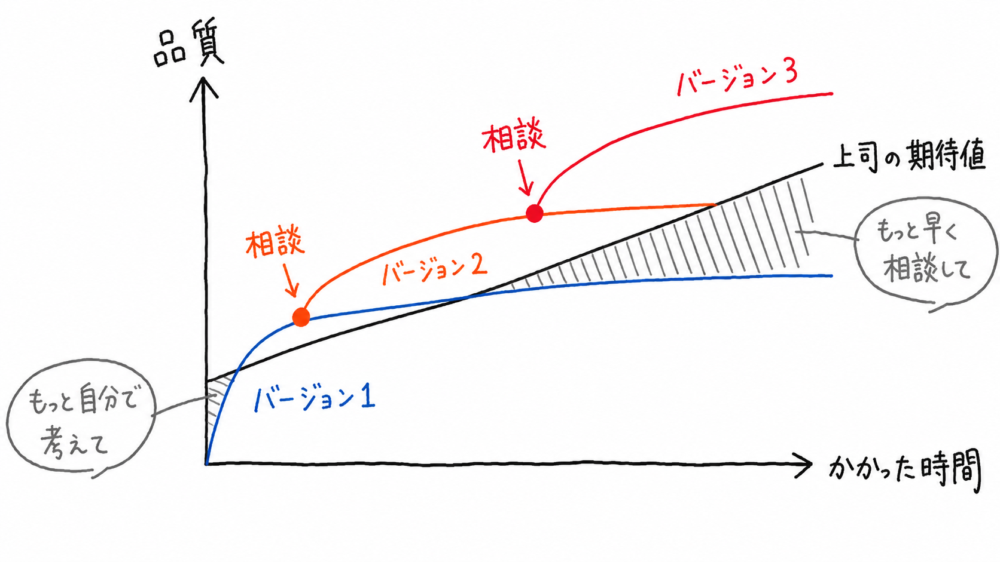

# Expectation Arbitrage {.unnumbered}

## はじめに

レビューを依頼するタイミングは難しい。検討が浅い段階では「もう少し自分で考えてから」と言われ、時間をかけすぎれば「そこまで作り込む前に相談して」と言われる。どちらの指摘にも理由があるが、実務を担う側には、どこまで自力で進めてからレビューに出すべきかという判断が残る。

本ノートでは、この判断を個人の経験やマネージャーとの相性だけに委ねず、時間配分の問題として捉える。成果物の品質は作業時間とともに上がるものの、その改善幅は次第に小さくなる。一方、待つ側の期待値は経過時間に応じて上がるため、品質と期待値の差はレビュー時点によって変化する。

{#fig-expectation-curve fig-alt="成果物の品質、上司の期待値、相談タイミングの関係を示した手書き図"}

早すぎる時点では、成果物の品質がレビューに必要な水準へ達していない可能性がある。反対に、遅い時点では追加作業による改善が小さくなる一方で、待つ側の期待値は上がっているかもしれない。その間に適切なレビュー時点があるとしても、成果物の性質、レビューする人、フィードバックによる改善効果によって位置は変わる。

この問題を整理するには、作業時間に対する品質の変化と、経過時間に対する期待値の変化を分けて考える必要がある。さらに、レビューを受けることで、その後の品質曲線がどう変わるかも考慮しなければならない。

## 限られた時間をどう配分するか

実務では、通常一つの成果物だけに時間を使えるわけではない。複数のプロジェクトや成果物が並行し、同じ労働時間を取り合っている。ある資料に追加で1時間を使うことは、別の仕事に使える時間を1時間減らすことでもある。

ここでは、次の問いを扱う。

- 限られた時間で、成果物全体の品質を最大化するにはどう時間を配分すべきか。
- 各成果物に対する評価を最大化する時間配分は、品質を最大化する配分と一致するか。
- レビューによる改善効果を含めると、相談のタイミングはどう変わるか。
- 成果物やマネージャーごとの差を、モデル上でどのように表現できるか。

以降では、これらを限られた時間の配分とレビュー時点の選択からなる最適化問題として記述し、シミュレーションを通じてその性質を確認する。

## なぜ Arbitrage なのか

「Arbitrage」は、ここでは厳密な金融用語ではなく、品質の改善速度と期待値の上昇速度のずれを表す比喩として使っている。狙いは、仕事量を減らして評価だけを高めることではない。レビューを適切な時点で挟むことで、不要な作り込みと手戻りを抑え、限られた時間から得られる成果を改善できるかを検討することにある。

スタッフにとっては作業のやり直しが減り、マネージャーにとっては方向修正がしやすくなる。結果として成果物の品質も高まるなら、関係者の利害は必ずしも対立しない。本ノートでは、そのような条件が存在するかを数理モデルとして検討する。

## References {.unnumbered}

::: {#refs}
:::
